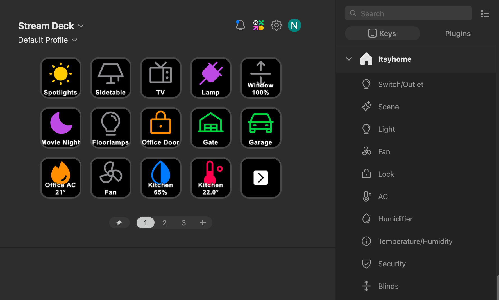

# Itsyhome Stream Deck plugin

[](https://github.com/nickustinov/itsyhome-streamdeck/actions/workflows/test.yml)

Stream Deck plugin for [Itsyhome](https://itsyhome.app) — control your HomeKit devices directly from your Elgato Stream Deck.



Requires **Itsyhome Pro** with the webhook server enabled (runs on `localhost:8423`).

## Actions

| Action | Description |
|--------|-------------|
| **Toggle device** | Toggle any HomeKit device on/off. Icon changes based on device type (light, switch, outlet, fan, etc.) |
| **Execute scene** | Trigger a HomeKit scene |
| **Set brightness** | Set a light to a specific brightness level. Shows current brightness on the key |
| **Lock** | Lock/unlock a door lock. Green locked icon, orange unlocked icon. 30s optimistic hold |
| **AC** | Toggle thermostat or AC on/off. Mode-aware icon (flame/snowflake/thermometer). Shows temperature |
| **Status** | Display-only — shows current temperature or humidity from sensors |
| **Blinds** | Open or close blinds. Direction-specific arrow icon. Shows current position % |
| **Garage door** | Open/close a garage door. Green car (closed), orange car (open). 30s optimistic hold |

## Features

- **Color-coded icons** per device type (gold for lights, blue for fans/AC, green for locks, orange for garage, purple for scenes, etc.)
- **Mode-aware AC icons** — flame for heating, snowflake for cooling, thermometer for auto. Dim version when off
- **Optimistic updates** — instant visual feedback on toggle. Locks and garage doors hold state for 30s while hardware catches up
- **Polling** — state updates every 3 seconds via localhost HTTP (negligible system impact)
- **Custom labels** — AC and blinds support an optional label field for multi-button setups (shows as `Label\nData`)
- **Device type filtering** — each action's property inspector only shows relevant devices

## Requirements

- macOS 14.0+
- Stream Deck software 6.5+
- Itsyhome with Pro subscription and webhook server enabled

## Development

### Setup

```sh
npm install
```

### Build

```sh
npm run build
```

### Watch mode

```sh
npm run watch
```

### Tests

```sh
npm test
```

### Install for development

Symlink the plugin bundle into the Stream Deck plugins directory:

```sh
ln -sf "$(pwd)/com.nickustinov.itsyhome.sdPlugin" \
  ~/Library/Application\ Support/com.elgato.StreamDeck/Plugins/com.nickustinov.itsyhome.sdPlugin
```

Then restart the Stream Deck app to load the plugin.

## Architecture

```
src/
  plugin.ts              — Entry point, registers all actions
  icons.ts               — Device type → icon path mapping
  api/
    itsyhome-client.ts   — HTTP client for the Itsyhome webhook API
  actions/
    toggle-device.ts     — Toggle on/off with device-type-aware icons
    execute-scene.ts     — Execute a HomeKit scene
    set-brightness.ts    — Set brightness to a fixed level
    lock.ts              — Lock/unlock with 30s optimistic hold
    thermostat.ts        — AC/thermostat toggle with mode icons and temperature display
    status.ts            — Read-only temperature/humidity display
    blinds.ts            — Open/close blinds with direction icons
    garage-door.ts       — Open/close garage door with 30s optimistic hold

com.nickustinov.itsyhome.sdPlugin/
  manifest.json          — Plugin manifest (actions, icons, SDK version)
  bin/plugin.js          — Built plugin bundle (generated)
  ui/                    — Property Inspector HTML files
  imgs/
    plugin/              — Category and marketplace icons
    actions/             — Per-action list icons and default key images
    device-types/        — Device-type-specific key images (colored on, dim off)
```

### Webhook API

The plugin communicates with Itsyhome's webhook server via HTTP on `localhost:8423`:

| Endpoint | Purpose |
|----------|---------|
| `GET /list/devices` | List all devices with type info |
| `GET /list/scenes` | List all scenes |
| `GET /info/{target}` | Get device state (on, brightness, temperature, mode, etc.) |
| `GET /toggle/{target}` | Toggle a device |
| `GET /scene/{target}` | Execute a scene |
| `GET /brightness/{value}/{target}` | Set brightness (0–100) |
| `GET /position/{value}/{target}` | Set position for blinds (0–100) |

### Icons

Icons are from [Phosphor Icons](https://phosphoricons.com/) (MIT licensed), rendered as colored PNGs with padding for title visibility:

- **On state**: Device-type-specific color (gold, blue, green, orange, etc.)
- **Off state**: Gray (`#606060`)
- **Canvas**: 80px icon on 144x144 canvas (@2x), offset from top for title room
- **Action list icons**: White monochrome, 20x20 / 40x40

### Build tooling

- **TypeScript** with TC39 decorators (Stream Deck SDK v2 pattern)
- **Rollup** bundles to a single `plugin.js`
- **Vitest** for unit tests

## Icon color reference

| Device type | Color | Icon |
|-------------|-------|------|
| Light, switch, outlet | `#F5C542` | Lightbulb / Power / Plug |
| Fan, heater-cooler, humidity sensor | `#4FC3F7` | Fan / Snowflake / Drop |
| Thermostat, temperature sensor | `#FF8A65` | Thermometer |
| Lock | `#66BB6A` | Lock (closed) / Lock-open (unlocked, `#FFA726`) |
| Garage door | `#66BB6A` closed / `#FFA726` open | Car |
| Blinds | `#90A4AE` | Arrow up / Arrow down |
| Scene | `#CE93D8` | Play |
| Security system | `#EF5350` | Shield |
| AC heat mode | `#FF6D3A` | Flame |
| AC cool mode | `#4FC3F7` | Snowflake |
| AC auto mode | `#AB47BC` | Thermometer |
